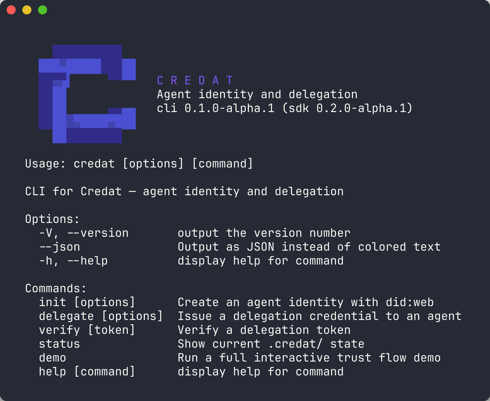
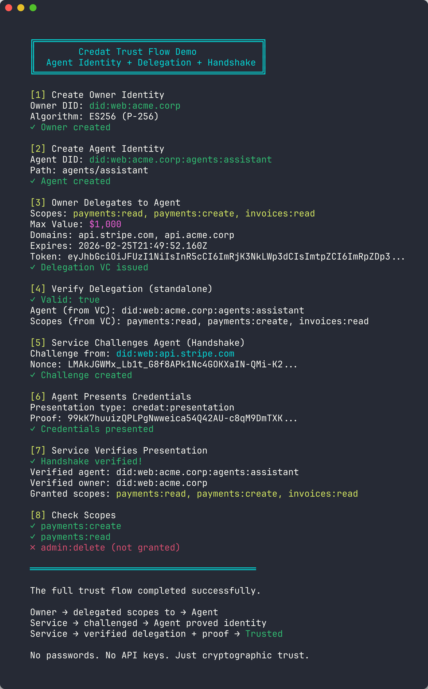

# @credat/cli

CLI for **Credat** — agent identity and delegation from the terminal.

Create decentralized identities (DIDs), issue delegation credentials, and verify trust chains — all without writing code.

<p align="center">
  
</p>

## Install

```bash
npm install -g @credat/cli
```

Requires Node.js >= 22.

## Quick Start

```bash
# 1. Create an agent identity
credat init --domain acme.corp

# 2. Delegate scopes to the agent
credat delegate --scopes payments:read,invoices:create --until 2026-12-31

# 3. Verify the delegation
credat verify
```

## Demo

Run `credat demo` to see the full trust flow in action — identity creation, delegation, verification, and challenge-response handshake:

<p align="center">
  
</p>

## Commands

### `credat init`

Create an agent identity with `did:web`.

```bash
credat init --domain acme.corp
credat init --domain acme.corp --path agents/assistant
credat init --domain acme.corp --algorithm EdDSA
credat init --domain acme.corp --force  # overwrite existing
credat init --domain acme.corp --output ./my-agent.json
```

| Option | Description |
|--------|-------------|
| `-d, --domain <domain>` | Domain for did:web (required) |
| `-p, --path <path>` | Optional sub-path |
| `-a, --algorithm <alg>` | `ES256` (default) or `EdDSA` |
| `-f, --force` | Overwrite existing agent identity |
| `-o, --output <file>` | Write agent to custom file path |

### `credat delegate`

Issue a delegation credential to an agent.

```bash
credat delegate --scopes payments:read,invoices:create
credat delegate --scopes payments:read --max-value 1000 --until 2026-12-31
credat delegate --agent did:web:other.agent --scopes admin:read
credat delegate --scopes payments:read --output ./delegation.jwt
```

| Option | Description |
|--------|-------------|
| `-a, --agent <did>` | Agent DID (defaults to `.credat/agent.json`) |
| `-s, --scopes <scopes>` | Comma-separated scopes (required) |
| `-m, --max-value <n>` | Maximum transaction value constraint |
| `-u, --until <date>` | Expiration date (ISO 8601) |
| `-o, --output <file>` | Write delegation to custom file path |

### `credat verify [token]`

Verify a delegation token. If no token is given, reads from `.credat/delegation.json`.

```bash
credat verify
credat verify eyJhbGciOiJFUzI1NiIs...
```

### `credat inspect [token]`

Decode and inspect a delegation token without cryptographic verification. Shows header, payload, selective disclosures, and expiration status.

```bash
credat inspect
credat inspect eyJhbGciOiJFUzI1NiIs...
credat inspect --file ./delegation.jwt
credat --json inspect
```

| Option | Description |
|--------|-------------|
| `-f, --file <path>` | Read token from a file (JSON or raw) |

### `credat revoke`

Revoke a delegation credential via a status list. Creates the status list automatically if it doesn't exist.

```bash
credat revoke
credat revoke --token eyJhbGciOiJFUzI1NiIs...
credat revoke --index 42
credat revoke --status-list ./custom-status-list.json
```

| Option | Description |
|--------|-------------|
| `-t, --token <token>` | Delegation token to revoke (defaults to `.credat/delegation.json`) |
| `-s, --status-list <path>` | Path to status list file (default: `.credat/status-list.json`) |
| `-i, --index <number>` | Status list index to revoke directly |

### `credat audit [token]`

Validate a delegation token against security best practices. Checks expiration, scope breadth, constraints, revocation endpoints, issuer/subject presence, and more.

```bash
credat audit
credat audit eyJhbGciOiJFUzI1NiIs...
credat --json audit
```

### `credat renew`

Renew an existing delegation with a new expiry date. Re-issues the credential with the same scopes and constraints.

```bash
credat renew --until 2027-06-30
credat --json renew --until 2027-06-30
```

| Option | Description |
|--------|-------------|
| `-u, --until <date>` | New expiration date, ISO 8601 (required) |

### `credat handshake`

Challenge/response trust verification flow. Four subcommands for interactive or programmatic use.

#### `credat handshake challenge`

Create a challenge for an agent to prove its identity.

```bash
credat handshake challenge --from did:web:service.example
```

| Option | Description |
|--------|-------------|
| `--from <did>` | Challenger DID (required) |

#### `credat handshake present`

Present credentials in response to a challenge.

```bash
credat handshake present --challenge '{"type":"credat:challenge","from":"did:web:service.example","nonce":"...","timestamp":"..."}'
```

| Option | Description |
|--------|-------------|
| `--challenge <json>` | Challenge JSON string (required) |

#### `credat handshake verify`

Verify a presentation against a challenge.

```bash
credat handshake verify \
  --presentation '{"type":"credat:presentation",...}' \
  --challenge '{"type":"credat:challenge",...}'
```

| Option | Description |
|--------|-------------|
| `--presentation <json>` | Presentation JSON string (required) |
| `--challenge <json>` | Challenge JSON string (required) |

#### `credat handshake demo`

Run a full handshake demo between two local agents — creates identities, delegates, challenges, presents, and verifies.

```bash
credat handshake demo
```

### `credat keys`

Import, export, and list key pairs.

#### `credat keys export`

Export a key pair in JWK format. Includes private key material.

```bash
credat keys export
credat keys export --as owner
credat --json keys export
```

| Option | Description |
|--------|-------------|
| `--as <type>` | `agent` (default) or `owner` |

#### `credat keys import <jwk-data>`

Import a key pair from JWK JSON. Requires an existing agent or owner file.

```bash
credat keys import '{"algorithm":"ES256","publicKey":{...},"privateKey":{...}}'
credat keys import '...' --as owner
```

| Option | Description |
|--------|-------------|
| `--as <type>` | Import as `agent` (default) or `owner` |

#### `credat keys list`

List current key fingerprints for agent and owner.

```bash
credat keys list
credat --json keys list
```

### `credat completions`

Generate shell completion scripts.

```bash
credat completions bash
credat completions zsh
credat completions fish
credat completions install  # show install instructions for your shell
```

### `credat status`

Show the current `.credat/` state: agent, owner, and delegation info.

```bash
credat status
credat --json status
```

### `credat demo`

Run a full interactive trust flow demo — creates identities, delegates, verifies, and completes a challenge-response handshake.

```bash
credat demo
```

## Global Options

| Option | Description |
|--------|-------------|
| `--json` | Output structured JSON (works with most commands) |
| `-V, --version` | Show CLI and SDK versions |
| `-h, --help` | Show help |

## How It Works

Credat uses **Verifiable Credentials** and **Decentralized Identifiers** (DIDs) to establish trust between agents and owners — no passwords, no API keys, just cryptographic proof.

1. **Owner** creates an agent identity (`did:web`)
2. **Owner** delegates specific scopes to the agent via a signed credential
3. **Services** verify the delegation and challenge the agent to prove its identity

## Links

- [@credat/sdk](https://www.npmjs.com/package/@credat/sdk) — core library ([GitHub](https://github.com/credat/credat))
- [@credat/mcp](https://www.npmjs.com/package/@credat/mcp) — MCP server middleware ([GitHub](https://github.com/credat/credat-mcp))
- [Documentation](https://docs.credat.dev)
- [DID specification](https://www.w3.org/TR/did-core/)
- [Verifiable Credentials](https://www.w3.org/TR/vc-data-model/)

## License

Apache-2.0
